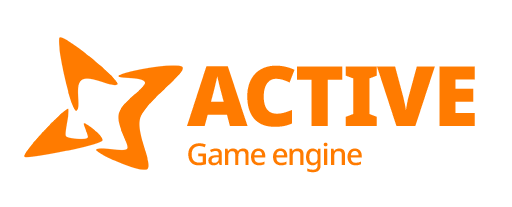

# Active Engine

  

## 2D and 3D cross-platform game engine

**[Active Engine](https://activeengine.org) is a feature-packed, cross-platform
game engine to create 2D and 3D games from a unified interface.** It provides a
comprehensive set of [common tools](https://activeengine.org/features), so that users can focus on making games
without having to reinvent the wheel. Games can be exported with one click to a
number of platforms, including the major desktop platforms (Linux, macOS,
Windows), mobile platforms (Android, iOS), as well as Web-based platforms
(HTML5) and
[consoles](https://docs.activeengine.org/en/latest/tutorials/platform/consoles.html).

## Free, open source and community-driven

Active Engine is completely free and open source under the very permissive [MIT license](https://activeengine.org/license).
No strings attached, no royalties, nothing. The users' games are theirs, down
to the last line of engine code. Active's development is fully independent and
community-driven, empowering users to help shape their engine to match their
expectations. It is supported by the [Software Freedom Conservancy](https://sfconservancy.org/)
not-for-profit.

Active Engine has started to be developed in October 2024, had been developed by [Anatoly Zubarev](https://github.com/reduz) as an in-house engine, used to publish out games.

## Documentation and demos

The official documentation is hosted on [ReadTheDocs](https://docs.activeengine.org).
It is maintained by the Active community in its own [GitHub repository](https://github.com/activeengine/active-docs).

The [class reference](https://docs.activeengine.org/en/latest/classes/)
is also accessible from the Active editor.

We also maintain official demos in their own [GitHub repository](https://github.com/activeengine/active-demo-projects)
as well as a list of [awesome Active community resources](https://github.com/activeengine/awesome-active).
